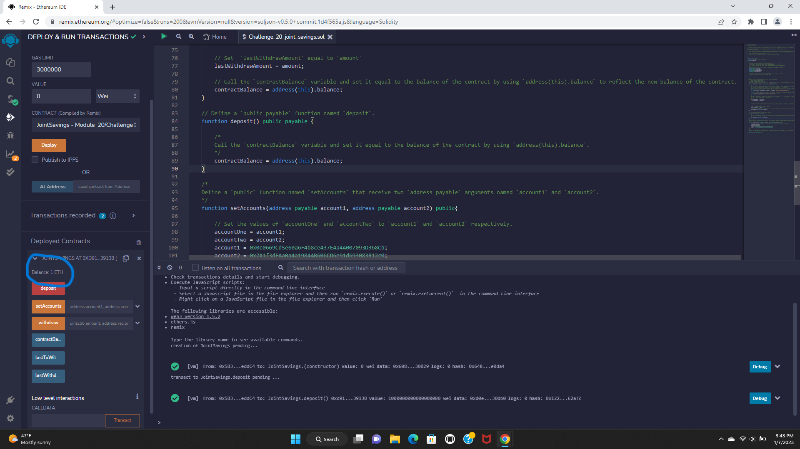
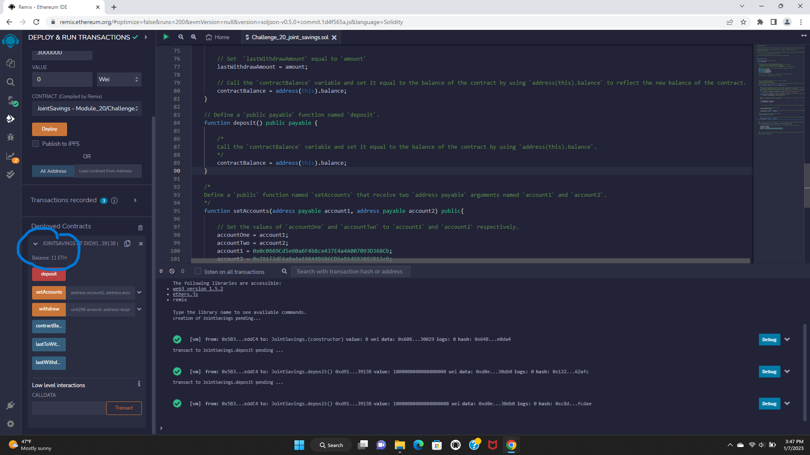
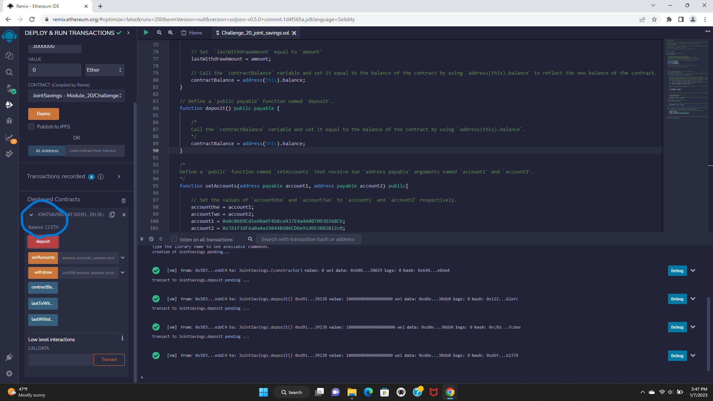

# *Module 20*
---
## Welcome to my ReadME file. Its been another hard week of wagie work but a successful and long week of coding!!! ##
# *in this readme file you will find a delployed SMART CONTRACT. WAHOOO!* #

## **Updating Address**

## **Purchasing 1 Ether as Wei**

## **Purchasing 10 Ether as Wei**

## **Purchasing 1 Ether **

